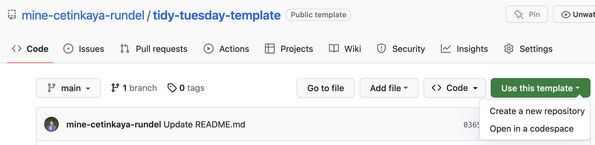
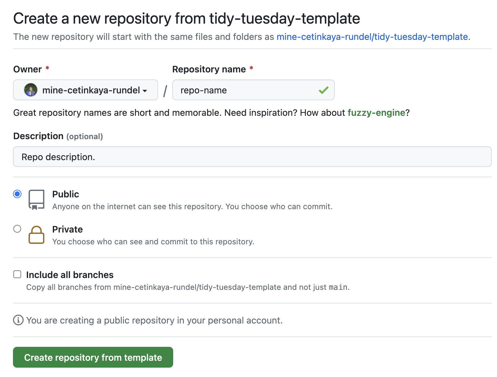

# tidy-tuesday-template

Getting started with this template for your own TidyTuesday projects:

1. Click on Use this template (green button) and then Create a new repository.

2. In the next screen,

  - select your GitHub account as the *Owner*,
  - give your repository a name that is relevant to TidyTuesday as well as the dataset you're going to be working with, e.g. if you'll be working with a dataset on cats, you might choose `tidy-tuesday-cats` (note no spaces!),
  - select *Public* for your project setting, and
  - click on *Create repository from template*.

